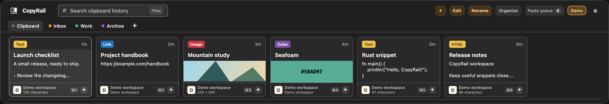
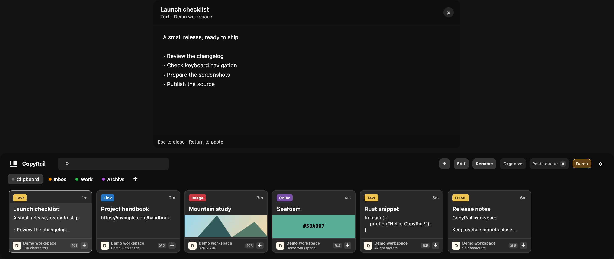
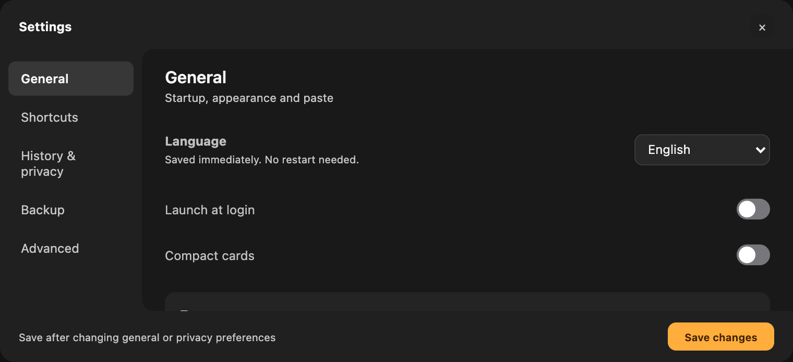
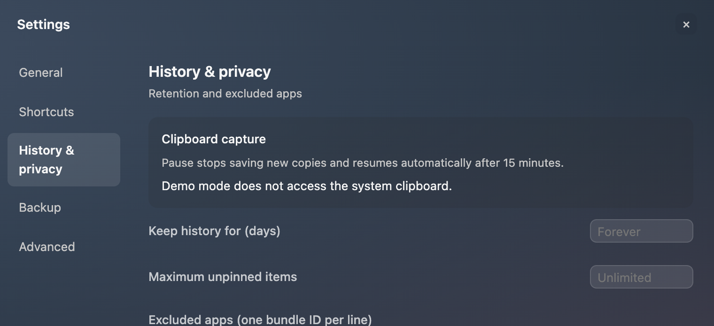

# CopyRail

[English](README.md) · **简体中文**

**在本机保存、查找和整理复制内容的 macOS 剪贴板工作区。**

CopyRail 把复制过的内容保存在可搜索的卡片轨道中。查找文本、预览图片，把常用内容整理到分类（Pinboard），再粘贴回正在使用的应用。软件使用 Rust、Tauri 和 Leptos 构建，历史记录保存在本机 SQLite 数据库中。



*截图使用软件内置的 English 语言设置和合成测试数据。[截图说明](docs/images/README.md)。*

## 可以做什么

- **查找复制过的内容。** 搜索历史，并按内容类型、来源应用、设备或时间筛选。
- **整理常用片段。** 创建分类，重命名条目、编辑文本，调整保存内容的顺序。
- **保留主界面的预览。** 在卡片轨道上方打开紧凑阅读窗，用方向键切换条目。
- **处理多种内容。** 支持纯文本、HTML、链接、图片、文件、PDF 和颜色。
- **按顺序逐条粘贴。** 把卡片加入待粘贴列表，按指定顺序填写多个输入框，也可输出纯文本。
- **选择界面语言。** 默认跟随系统语言：中文系统使用简体中文，其他系统使用 English。在「设置 → 通用 → 语言」可选择跟随系统、简体中文或 English，手动选择会立即保存并在下次启动时保留。
- **决定保留哪些内容。** 暂停采集、忽略指定应用、设置保留上限，以及导出和恢复本地备份。
- **使用键盘操作。** `⇧⌘V` 打开主界面，左右方向键选择，`Space` 预览，`⌘C` 复制。

### 在卡片上方预览

阅读较长文本时，下方仍保留剪贴板历史。



### 按用途分组的设置

设置分为通用、快捷键、历史与隐私、备份和高级。采集控制和快捷键说明集中在设置中。

在 **通用 → 语言** 切换界面语言会立即生效，不会顺带保存其他尚未保存的设置。“跟随系统”会在启动时读取 macOS 首选语言，可随时切回以取消手动指定。复制内容、分类名称和用户输入不会被翻译。





## 快速使用

1. 在其他应用中复制内容。CopyRail 运行期间会保存新出现的、受支持的剪贴板内容。
2. 按 `⇧⌘V` 打开卡片轨道，搜索或选中一张卡片。
3. 按 `Space` 预览，或按 `⌘C` 复制选中的内容，然后在目标应用中正常粘贴。
4. 若要直接粘贴，先把光标放入目标输入框，再用 `⇧⌘V` 打开 CopyRail，按 `Return`。此功能需要 macOS 辅助功能权限。

使用顺序粘贴时，按所需顺序点击卡片上的 **+**。把光标放到第一个目标输入框，打开 CopyRail 并按 `Return`；之后在下一个输入框重复操作。成功发送粘贴请求后，待粘贴数量会减少；仅复制或请求失败不会移出该条。点击「顺序粘贴」可清空待粘贴列表，不会删除历史记录。

隐藏主界面后，采集仍会继续。可以在设置或菜单栏中暂停采集，或退出 CopyRail 停止采集。

## 当前状态与平台

CopyRail 是**早期源码 MVP**，主要在 Apple Silicon macOS 上开发和测试。当前本地迭代为 **0.1.0-local-beta.18**，尚未提供经过 Developer ID 签名和公证的二进制发行版。

以上功能已经实现，但不代表完成了所有日常使用场景的验收。跨应用粘贴和拖放、复杂富文本保真、全屏 Spaces、多显示器以及 VoiceOver 仍有待验收项目。共享分类、多设备同步和移动客户端不在本次 MVP 承诺范围内。具体检查范围见[验证记录](docs/verification.md)。

## 从源码运行

需要 macOS、Xcode Command Line Tools、[Rustup](https://rustup.rs/) 和 Trunk。仓库固定 Rust **1.98.0**，已验证的 Trunk 版本为 **0.21.14**。首次构建会下载公开依赖。

```sh
git clone https://github.com/AresNing/CopyRail.git
cd CopyRail
rustup target add wasm32-unknown-unknown
cargo install trunk --version 0.21.14 --locked
cd apps/desktop
../../scripts/trunk.sh build --config Trunk.toml
cd ../..
cargo run -p pasters-desktop --no-default-features --locked
```

MVP 请保留 `--no-default-features`，以排除实验性的 CloudKit 传输。旧脚本 `scripts/dev.sh` 会启用默认特性，不是推荐的 MVP 启动入口。

## 本地数据与隐私

- 历史数据库位于 `~/Library/Application Support/io.pasters.desktop/history.db`。内部应用标识暂时保留，以兼容早期 PasteRS 数据。
- 软件**不会对历史记录和备份额外加密**。升级前应退出应用并备份数据；恢复备份会替换现有数据。
- 默认跳过机密和瞬态剪贴板类型。可以通过忽略应用和暂停采集进一步限制记录范围。
- 提供面向明确授权客户端的本地 stdio MCP 接口，默认关闭，不开放网络监听端口。

安全模型与问题反馈方式见 [SECURITY.md](SECURITY.md)。成功复制内容与确认其他应用接收了直接粘贴，是两个不同的结果。

## 开发与验证

```sh
./scripts/check.sh
node --test scripts/maintain-artifacts.test.mjs scripts/check-local-qa-preparation.test.mjs scripts/check-native-tab-trace.test.mjs
```

检查包括格式、Rust 测试、严格的主机与 WASM Clippy，以及前端构建。脚本测试需要 Node.js 22 或更高版本。编译后界面检查使用独立的无头 Chrome 配置和合成 IPC，需要在 macOS 默认位置安装 Google Chrome。

```sh
node scripts/check-copyrail-design-ui.mjs
node scripts/check-workspace-interactions-ui.mjs
node scripts/check-toolbar-settings-ui.mjs
node scripts/check-language-ui.mjs
node scripts/capture-readme-ui.mjs
```

截图命令使用正式界面的语言设置和文档测试数据，不读取真实剪贴板历史，也不修改编译后的应用资源。详见[截图生成说明](docs/images/README.md)。

构建前端后，可使用临时合成数据库进行原生测试：

```sh
cargo run -p pasters-desktop --no-default-features --locked -- --native-ui-test
```

此调试模式拒绝真实采集、写入系统剪贴板以及云端和账户操作。浏览器测试不能替代原生验收。内置 PDF 阅读器另有[测试样本与验证说明](apps/desktop/src-tauri/fixtures/README.md)。

本地交付总共保留三个版本，包含当前版本。清理前先预览，再删除旧交付组和可重新生成的构建产物；保留源码、测试样本、用户数据和验收证据。

## 项目结构

| 路径 | 用途 |
| --- | --- |
| `apps/desktop` | Leptos/WASM 界面和样式 |
| `apps/desktop/src-tauri` | 桌面外壳、原生窗口、预览、编辑和 MCP |
| `crates/paste-domain`、`paste-core`、`paste-storage` | 领域类型、用例、SQLite 历史和搜索 |
| `crates/paste-platform` | macOS 剪贴板、权限和窗口集成 |
| `crates/paste-sync`、`paste-cloudkit` | 实验性同步组件，不属于 MVP 承诺范围 |
| `scripts` | 构建辅助、合成界面检查和产物维护 |

[架构](docs/architecture.md) · [验证](docs/verification.md) · [依赖](docs/dependencies.md)

## 许可证与独立性

Copyright 2026 CopyRail contributors。除另有说明外，项目自有代码、文档和原创图形采用 **[Apache-2.0](LICENSE)** 许可证。署名信息见 [NOTICE](NOTICE)，第三方条款见 [THIRD_PARTY_NOTICES.md](THIRD_PARTY_NOTICES.md)。

早期研究参考过 Paste 等剪贴板工具。CopyRail 目前采用自身的卡片轨道标识和设计基线，是独立项目，与 Paste Team ApS 无隶属或背书关系。本仓库许可证不授予第三方名称、商标或素材的使用权。
